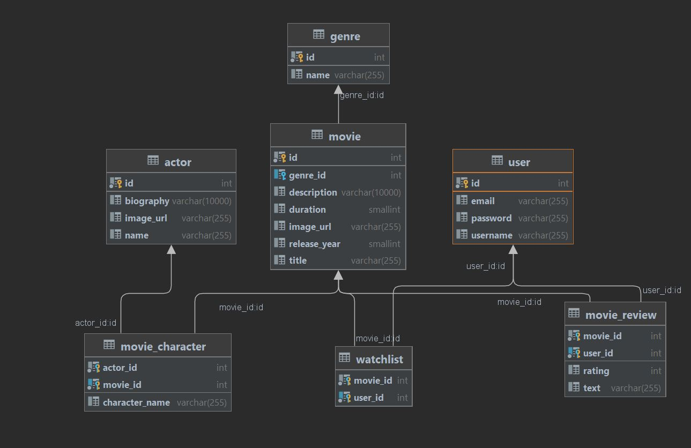

# movier
Movie review web application

## Functionalitati:

- Utilizatorii pot vizualiza detalii legate de filme si de actori
- Utilizatorii autentificati pot adauga filme in watchlistul propriu
- Utilizatorii autentificati pot adauga recenzii filmelor
- Utilizatorii sunt de doua tipuri: utilizatori basic si administrator
- Administratorul poate adauga, edita si sterge filme

## Schema bazei de date:

## Demo:

<figure class="video_container">
  <video controls="true" allowfullscreen="true">
    <source src="presentation/demo.mp4" type="video/mp4">
  </video>
</figure>
<video width="320" height="240" controls src="presentation/demo.mp4"></video>